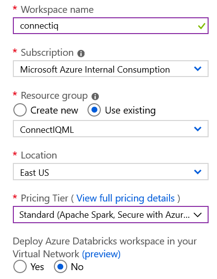
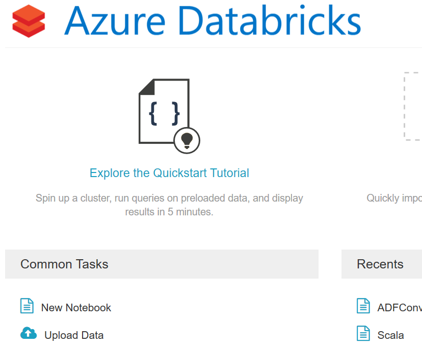
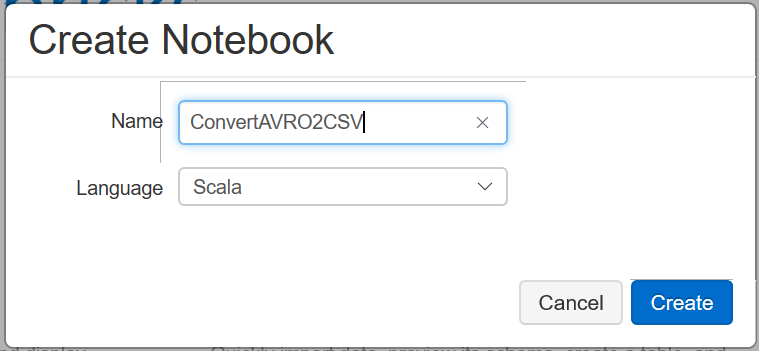
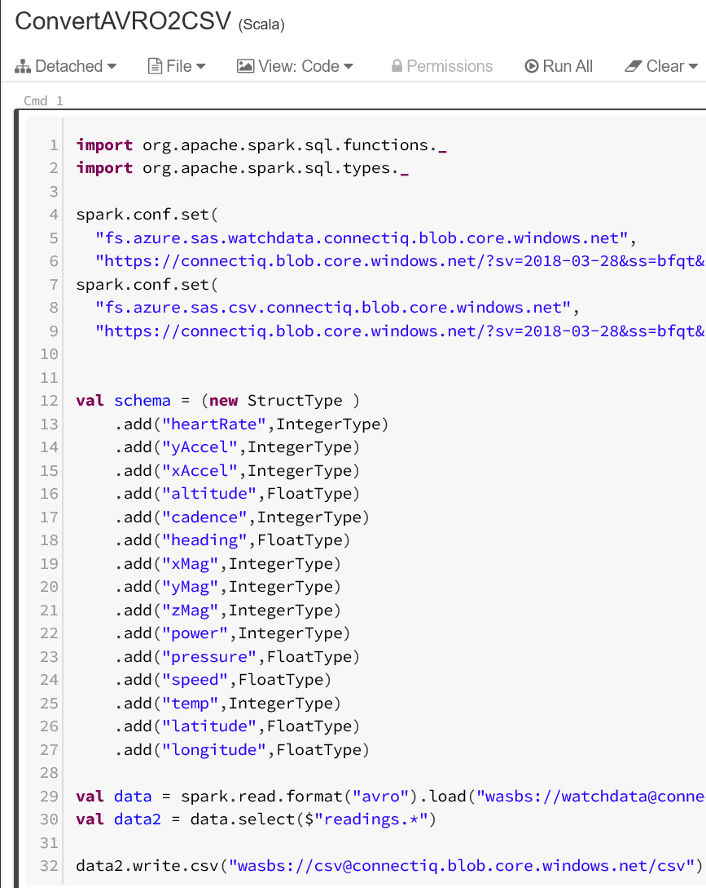
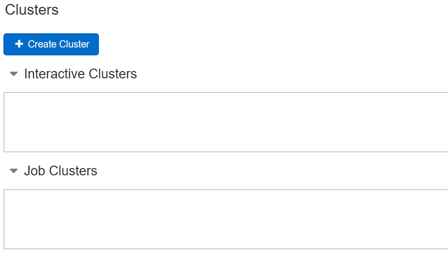
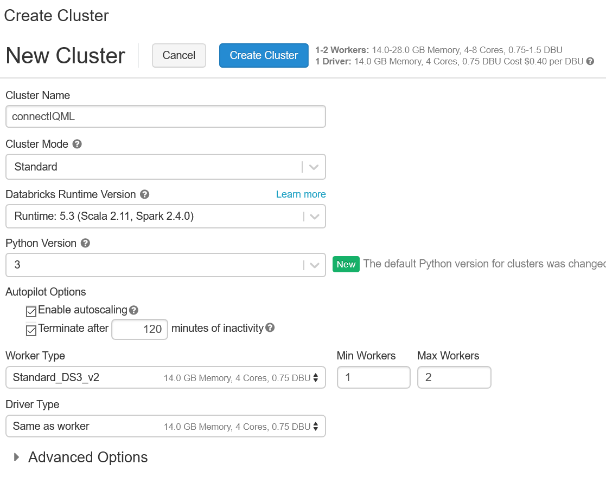
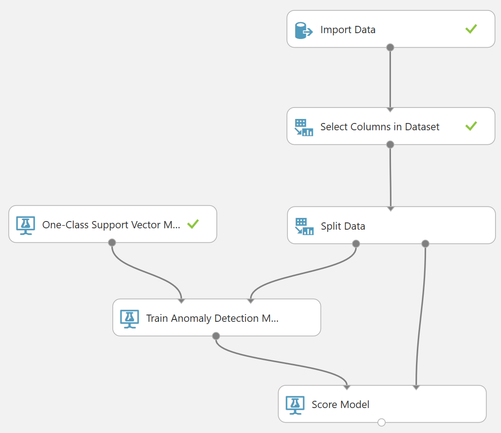
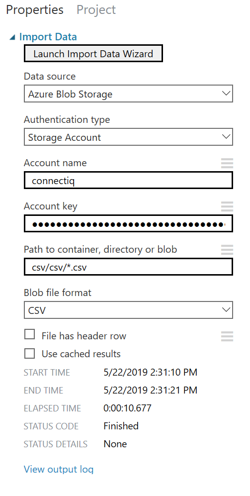

# Heart Rate data anomoly detection
**produced by Dave Lusty**

# Introduction
This guide details how to use the data generated by the Garmin watch application to train a machine learning model. In this demo we'll generate some resting HR data, then transform it with Data Factory and Azure Databricks. Finally we'll train a model using a "one class SVM" algorithm for anomoly detection before publishing that model as a web service. The one class SVM uses statistical analysis to detect outlier data, so when we generate new data with unusual values (such as during exercise) it will detect an anomoly.

You can find videos of this demo and the rest in the series on Youtube at the following locations:
[Part 1 - Intro](https://youtu.be/_39eKRNK3UU)
[Part 2 - Initial Platform Build](https://youtu.be/9llyGjfKiLo)

The architecture for this demo is shown below.


## Prerequisites
You'll need to have completed the previous demo so you can generate some useful data to train the model with. You can find this at [Watch demo infrastructure](https://github.com/davedoesdemos/ConnectIQ-Watch-IoT/blob/master/IoTWatchInstructions.md) but if you don't have a device you can skip over to YouTube and see the demo videos instead.

# Generate data
If you have previous test data in your storage account, open that account and delete the entire container and data. For this demo to work, we need some stable resting heart rate data so the previous data might not be useful. Please bear in mind we're doing this so the demo works - in real life we don't ordinarily cheat like this with our data sets for machine learning. Once deleted, recreate the storage container so that new data will have somewhere to go.
Next, sit in a chair and relax for a few minutes. Lying down will also work. Once relaxed, start the demo app on your watch to start recording "resting" data. Continue to relax for a few minutes to gather a reasonable amount of training data. Stop the app on your watch and check that you have some data in your storage account.

# Data Transformation

For the transformation, we'll be using Azure Databricks with a transformation script written in Scala. There are many, many ways to achieve this transformation and I'll cover some of those in later demos. We'll be triggering the script from Azure Data Factory here. Although not strictly necessary, a normal next step would be to "industrialise" the process of training the model so that we can later re-train based on new data. This would involve a recurring job in Data Factory to copy new data for training.

## Azure Databricks

First, create a new Azure Databricks workspace called "connectiq" and place it into your demo resource group with the othe components for the watch demo. Select the standard pricing tier and choose not to place the workspace on your network.



Once the workspace is deployed, open it in the portal and choose Launch Workspace.


Once in the workspace, click New Notebook to create a notebook. This is similar to a script, and allows you to place code into a document and see output from that code within the same document.



Give the notebook a name such as ConvertAvroToCSV, and choose Scala as the language. Everything here can also be achived in Python so when writing your own scripts choose 





```scala
import org.apache.spark.sql.functions._
import org.apache.spark.sql.types._

//Set up Blob storage keys
spark.conf.set(
  "fs.azure.sas.YOURWATCHDATACONTAINER.YOURSTORAGEACCOUNT.blob.core.windows.net",
  "https://YOURSTORAGEACCOUNT.blob.core.windows.net/?sv=2018-03-28&ss=REST OF YOUR SAS TOKEN")
spark.conf.set(
  "fs.azure.sas.YOURTARGETDATACONTAINER.YOURSTORAGEACCOUNT.blob.core.windows.net",
  "https://YOURSTORAGEACCOUNT.blob.core.windows.net/?sv=2018-03-28&ss=REST OF YOUR SAS TOKEN")

//Create the schema based on what the watch app sends
val watchSchema = (new StructType )
    .add("heartRate",IntegerType)
    .add("yAccel",IntegerType)
    .add("xAccel",IntegerType)
    .add("altitude",FloatType)
    .add("cadence",IntegerType)
    .add("heading",FloatType)
    .add("xMag",IntegerType)
    .add("yMag",IntegerType)
    .add("zMag",IntegerType)
    .add("power",IntegerType)
    .add("pressure",FloatType)
    .add("speed",FloatType)
    .add("temp",IntegerType)
    .add("latitude",FloatType)
    .add("longitude",FloatType)

//Import the data in AVRO format from Blob and extract the JSON payload using the above schema
//Use wildcards in the path to select less data if needed
val data = spark.read.format("avro").load("wasbs://YOURWATCHDATACONTAINER@YOURSTORAGEACCOUNT.blob.core.windows.net/YOURSTORAGEACCOUNT/watchdata/0/2019/*/*/*/*/*").selectExpr("cast (body as string) as json").select(from_json($"json", schema=watchSchema).as("readings"))
//Select the data we need, in this case just heart rate data
val data2 = data.select($"readings.heartRate")
//Output the data to Blob in CSV Format
data2.write.csv("wasbs://YOURTARGETDATACONTAINER@YOURSTORAGEACCOUNT.blob.core.windows.net/csv")
```






## Data Factory

# Machine Learning

## ML Studio






# Testing